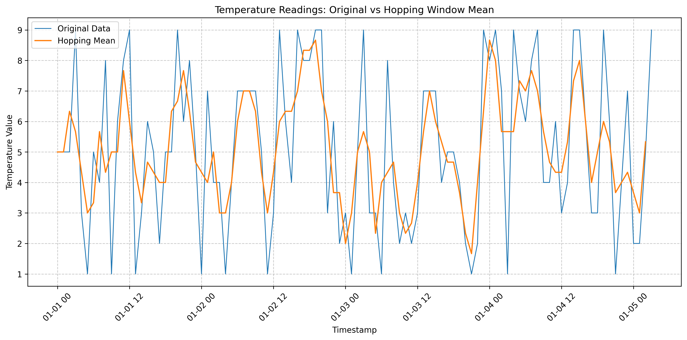

# Hopping Window Mean Aggregation
This project demonstrates the use of a hopping window function to aggregate mean values of temperature readings in a distributed sensor system.

## Overview
In an enterprise distributed environment, the sensor system generates temperature readings every second. To increase throughput and reduce latency, the stream processor aggregates mean values of the sensor readings using a hopping window function.

## Implementation Steps

1. **Data Generation**
   - Creates a time series dataset with 100 hourly temperature readings
   - Time range: 2024-01-01 00:00:00 to 2024-01-05 03:00:00
   - Temperature values: Random integers between 1 and 10

2. **Hopping Window Configuration**
   - Window size: 3 hours (window_size = '3h')
   - Hop interval: 1 hour (hop_size = '1h')
   - This means the window "hops" forward by 1 hour while maintaining a 3-hour view

3. **Mean Calculation**
   - For each hop, calculates the mean of temperature values in the current 3-hour window
   - Uses pandas rolling function with specified window size
   - Minimum periods set to 1 to handle edge cases

4. **Data Structure**
   ```python
   # Create sample time series dataframe
   data = {
       'timestamp': pd.date_range(start='2024-01-01', periods=100, freq='h'),
       'value': np.random.randint(1, 10, 100)
   }
   df = pd.DataFrame(data)
   ```

5. **Window Function**
   ```python
   # Create hopping windows
   df['hopping_mean'] = df['value'].rolling(window=window_size, min_periods=1).mean().shift(-1)
   ```

## Visualization
The implementation includes a visualization comparing the original temperature readings with the hopping window mean values:



### Visualization Analysis
- Blue line: Original temperature readings (raw data)
- Orange line: Hopping mean values (3-hour window averages)
- The hopping mean line shows smoother transitions, effectively reducing noise while maintaining the overall temperature trends
- The smoothing effect demonstrates how the hopping window helps in identifying underlying patterns in the data

## Benefits
1. **Reduced Noise**: The 3-hour window averaging helps smooth out short-term fluctuations
2. **Improved Throughput**: By aggregating data, we reduce the volume of data that needs to be processed downstream
3. **Pattern Detection**: Easier identification of temperature trends over time
4. **Latency Management**: Regular updates every hour provide a good balance between real-time updates and processing efficiency

## Usage
1. Ensure you have the required dependencies:
   ```bash
   pip install pandas numpy matplotlib
   ```
2. Run the script:
   ```bash
   python Hoppingwindow_100periods-1.py
   ```
3. The script will:
   - Generate sample temperature data
   - Calculate hopping window means
   - Display a DataFrame with original and mean values
   - Show the visualization plot
